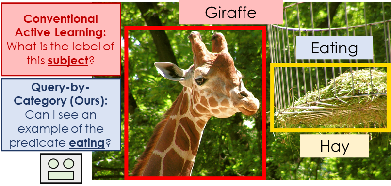

Can I see an Example? Active Learning the Long Tail of Attributes and Relations
=====================================
This is PyTorch code for our BMVC-2022 paper available on [arXiv](https://arxiv.org/abs/2203.06215).

**Abstract:** There has been significant progress in creating machine learning models that identify objects in scenes
along with their associated attributes and relationships; however, there is a large gap between the best models and
human capabilities. One of the major reasons for this gap is the difficulty in collecting sufficient amounts of
annotated relations and attributes for training these systems. While some attributes and relations are abundant, the
distribution in the natural world and existing datasets is long tailed. In this paper, we address this problem by
introducing a novel incremental active learning framework that asks for attributes and relations in visual scenes. While
conventional active learning methods ask for labels of specific examples, we flip this framing to allow agents to ask
for examples from specific categories. Using this framing, we introduce an active sampling method that asks for examples
from the tail of the data distribution and show that it outperforms classical active learning methods on Visual Genome.



In classical active learning, an agent selects _examples_ that it is most uncertain about to be labeled.
Conversely, we allow agents to ask for examples at the _category_ level instead of the example level. We train
agents to predict attributes and relations in scenes. Our framing allows an agent to ask for an example of a rare
category `eating` and an oracle provides an example of this predicate. By changing the
question framing, we show that a simple method that asks for specific labels outperforms several active learning
baselines.

Our Visual Genome data parsing methods are built on the sg2im [[1]](#1) and simsg [[2]](#2) codebases.

## Dependencies

We have tested the code with the following packages and versions:

- Python 3.8.10
- PyTorch (GPU) 1.8.0
- torchvision 0.9.0
- CUDA 10.2
- NVIDIA GPU

We recommend setting up a `conda` environment with these same package versions:

```
conda create -n long_tail_continual_active_learning python=3.8.10
conda activate long_tail_continual_active_learning
pip install tensorboard
pip install tqdm
pip install -U scikit-learn
pip install matplotlib
pip install h5py
pip install wheel
pip install pycocotools # for coco training
conda install pytorch=1.8.0 torchvision=0.9.0 cudatoolkit=10.2 -c pytorch
```

## Training Faster RCNN Feature Extractor

We first train an object detection model to extract feature vectors for ground truth boxes in images. Specifically, we
train a Faster RCNN model with a ResNet-50 backbone on the MS COCO 2017 dataset. We then extract feature vectors for
each box from after the ROI pooling layer. We provide scripts to reproduce this process in the directory
[train_object_detection_feature_extractor](./train_object_detection_feature_extractor) and describe the steps below:

- Download and unzip train images, val images, and annotations for the [MS COCO 2017](https://cocodataset.org/#download)
  dataset into three folders (train2017, val2017, annotations) in the same parent directory

```
wget http://images.cocodataset.org/zips/train2017.zip
wget http://images.cocodataset.org/zips/val2017.zip
wget http://images.cocodataset.org/annotations/annotations_trainval2017.zip
```

- Train a Faster RCNN model with a ResNet-50 backbone on COCO by changing appropriate path parameters and
  hyper-parameters in [train_faster_rcnn.sh](./bash_scripts/train_faster_rcnn.sh)
  or [train.py](./train_object_detection_feature_extractor/train.py)
- Set path to COCO pre-trained checkpoint in [config.py](config.py)

## Setting up the Triple Completion Visual Genome Dataset

Next, we will set up the Visual Genome dataset for the triple completion problem presented in our paper. I apologize in
advance for the lengthy and time-consuming data creation process in this step. :upside_down_face: We provide scripts to
generate the necessary files in the directory [setup_data](./setup_data) and describe the steps below:

- Download files for [Visual Genome Version 1.4](https://visualgenome.org/api/v0/api_home.html): `images.zip`
  , `images2.zip`, `attribute_synsets.json`, `attributes.json`, `image_data.json`, `object_alias.txt`
  , `object_synsets.json`, `objects.json`, `relationship_alias.txt`, `relationship_synsets.json`, `relationships.json`
- Unzip all files and put all images into a single directory (`VG_100K_all`)
- Download train/val/test
  splits: [vg_splits.json](https://github.com/google/sg2im/blob/master/sg2im/data/vg_splits.json)
- Set paths to Visual Genome images and meta-data files in [config.py](config.py)
- Run [preprocess_vg.py](./setup_data/preprocess_vg.py) to filter data and create files: `vocab.json`, `train.h5`
  , `val.h5`, `test.h5`. This step will filter the dataset into: 62,565 train, 5,062 validation, and 5,096 test images
- Run [extract_bbox_features.py](./setup_data/extract_bbox_features.py) to save bounding box feature vectors and
  bounding box coordinates to h5 files. This step will create files: `vg_box_rn50_features_train.h5`
  , `vg_box_rn50_features_val.h5`, `vg_box_rn50_features_test.h5`, `vg_box_coordinates_train.h5`
  , `vg_box_coordinates_val.h5`, `vg_box_coordinates_test.h5`
- Run [make_qtype_h5_files.py](./setup_data/make_qtype_h5_files.py) to save the question-based dataset and scene graphs to h5 files.
  This step will create files: `vg_qtype_dset_train.h5`, `vg_qtype_dset_val.h5`, `vg_qtype_dset_test.h5`
  , `vg_scene_graphs_attributes1_train.h5`, `vg_scene_graphs_attributes1_val.h5`, `vg_scene_graphs_attributes1_test.h5`
  , `vg_scene_graphs_triples1_train.h5`, `vg_scene_graphs_triples1_val.h5`, `vg_scene_graphs_triples1_test.h5`
- Run [save_qtype_class_dicts.py](./setup_data/save_qtype_class_dicts.py) to save dictionaries out where the keys in the
  dictionary pertain to class_ids and the values contain a list of question_ids with that class_id. This step will
  create files: `vg_qtype_attribute_dict_train.json`, `vg_qtype_attribute_dict_val.json`
  , `vg_qtype_attribute_dict_test.json` , `vg_qtype_predicate_dict_train.json`, `vg_qtype_predicate_dict_val.json`
  , `vg_qtype_predicate_dict_test.json`

Following these steps will yield a question-based dataset containing 3,474,969 training, 279,273 validation, and 281,739
testing questions. The dataset contains 253 unique attributes classes and 46 unique predicate classes. Histograms of the
training class distributions are provided below.

### Attributes


### Predicates


## Training Models

In the folder [bash_scripts](./bash_scripts), we have provided bash scripts to run each experiment from our paper. Make
sure to set the appropriate path parameters in each script. We describe each bash file in more detail below.

**Baselines:**

- [train_pre_train_model_baselines.sh](./bash_scripts/train_pre_train_model_baselines.sh)
    - Trains the pre-train model baselines on a subset of samples from the head classes of the train set and evaluates
      them on the full test set and tail test set
- [train_offline_model_baselines.sh](./bash_scripts/train_offline_model_baselines.sh)
    - Trains the offline model baselines on the full train set and evaluates them on the full test set and tail test set

After training the pre-train model baselines, we can train the incremental active learners starting from these
checkpoint files.

**Incremental Active Learners:**

- [final_tail_uniform_class_experiments.sh](./bash_scripts/final_tail_uniform_class_experiments.sh)
    - Trains the main version of our tail method (with uniform probabilities) in two settings: using re-balanced
      mini-batches and using standard mini-batches
- [final_tail_frequency_class_experiments.sh](./bash_scripts/final_tail_frequency_class_experiments.sh)
    - Trains the frequency probability version of our tail method in two settings: using re-balanced mini-batches and
      using standard mini-batches
- [final_al_method_experiments.sh](./bash_scripts/final_al_method_experiments.sh)
    - Trains four active learning methods: random, entropy, margin, and confidence in two settings: using re-balanced
      mini-batches and using standard mini-batches
- [final_al_methods_no_head.sh](./bash_scripts/final_al_methods_no_head.sh)
    - Trains three active learning methods: entropy, margin, and confidence when only selecting from tail data

## Evaluating Models

Our scripts for training the pre-train and full offline baselines save out the following results files:

- Final model checkpoint (`triple_completion_model_final_ckpt.pth`)
- Final full test set results (`full_results_increment_-1.json`)
- Final tail test set results (`tail_results_increment_-1.json`)

Our scripts using re-balanced mini-batches save out the following results for each model at each increment (`INC`):

- Model checkpoint before bias correction (`triple_completion_model_final_id_INC_ckpt.pth`)
- Model checkpoint after bias correction (`triple_completion_model_with_bias_correction_final_inc_INC_ckpt.pth`)
- Full test set results before bias correction (`before_bias_correction_full_results_increment_INC.json`)
- Tail test set results before bias correction (`before_bias_correction_tail_results_increment_INC.json`)
- Full test set results after bias correction (`full_results_increment_INC.json`)
- Tail test set results after bias correction (`tail_results_increment_INC.json`)
- Class distribution of samples chosen by the active learner (`active_learn_increment_INC_sample_distributions.json`)
- Indicies of chosen active learning samples w.r.t. full train dataset (`active_learn_increment_INC_chosen_ixs.json`)

Our scripts also save out tensorboard logs for the cross-validation and training stages in a directory
called `tf_logging`

We provide a script to parse the final incremental active learning results for each method and create plots
in [parse_final_results.py](parse_final_results.py). To save plots, change the parameters and directory in `main`. This
script will compute Ω metrics for all experiments and print values to the console

Note that when saving plots and results to files, question types are denoted either by integers or 4-letter acronyms as
follows (last element in the acronym indicates the missing triple element):

0. (?, p, o) = SPOS
1. (?, p, a) = SPAS
2. (s, ?, o) = SPOP
3. (s, ?, a) = SPAP
4. (s, p, o?) = SPOO
5. (s, p, a?) = SPAA

All results files contain dictionaries where the key is the integer question-type and the value is a list of associated
performance metrics. Specifically, the first and second values in the list indicate Micro AUROC and Micro mAP
performance on that question, respectively. For more information, see the `evaluate` function
in [evaluate.py](./train_continual_active_learners/evaluate.py) where these metrics are computed

## References

<a id="1">[1]</a> Johnson, Justin, Agrim Gupta, and Li Fei-Fei. Image generation from scene graphs. In CVPR, 2018.
Code: https://github.com/google/sg2im

<a id="2">[2]</a> Dhamo, Helisa, Azade Farshad, Iro Laina, Nassir Navab, Gregory D. Hager, Federico Tombari, and
Christian Rupprecht. Semantic image manipulation using scene graphs. In CVPR, 2020.
Code: https://github.com/he-dhamo/simsg

## Citation

If using this code, please cite our paper.

```
@inproceedings{Hayes_2022_Can_I_See_An_Example,
  title={Can I see an Example? Active Learning the Long Tail of Attributes and Relations},
  author={Hayes, Tyler L. and Nickel, Maximilian and Kanan, Christopher and Denoyer, Ludovic and Szlam, Arthur},
  booktitle={British Machine Vision Conference (BMVC)},
  year={2022}
}
```